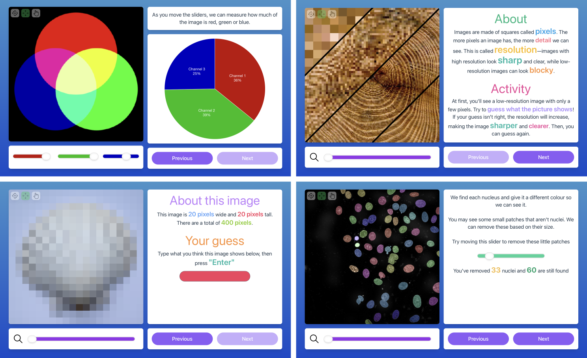

# MIA for Schools
(In development) Web-based version of [ModularImageAnalysis (MIA)](https://github.com/mianalysis/mia) designed for interactive teaching of image analysis concepts to school children.  The MIA for Schools project presents students with short, interactive workflows on topics such as image structure, resolution and object segmentation.

Developed as part of the Royal Microscopical Society (RMS) [DAIM](https://www.rms.org.uk/community/science-sections/image-analysis.html) and [Outreach & Education](https://www.rms.org.uk/community/science-sections/outreach.html) sections.



## Local installation
Requires copy of [mia-server](https://github.com/mianalysis/mia-server) to also be running.

```bash
$ npm install
```

```bash
$ cp .env.example .env
```

```bash
$ npm run dev
```
